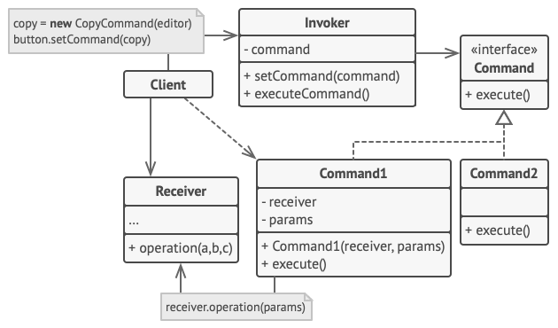

# `Command` Pattern

## **Introduction**

**`Command` Pattern**:

- **encapsulate a `request`** under an object as **a `command`**
- pass it to invoker object.

Invoker object:

- looks for the appropriate object which can handle this command
- pass the command to the corresponding object and that object executes the command

## **Components**

- **Command** (Interface): Định nghĩa contract chung, thường chỉ có một hàm `execute()`.
- **Concrete Command**: Class implement cụ thể. Nó **chứa data của request** và **gọi đúng hàm của Receiver**.
- **Receiver**: Thằng trực tiếp cầm logic nghiệp vụ lõi.
- **Invoker**: Thằng kích hoạt Command. Nó đách cần biết Command làm gì, chỉ biết **gọi execute()**.
- **Client**: Nơi lắp ráp Command với Receiver và giao cho Invoker.

## **Advantages**

- Tách biệt đối tượng gọi thao tác (**Invoker**) khỏi đối tượng thực sự thực hiện thao tác (**Receiver**).
- Giúp dễ dàng thêm các commands mới, vì các lớp hiện có không thay đổi.

## **Usecases**

- cần tham số hóa các đối tượng theo hành động cần thực hiện.
- cần tạo và thực thi các yêu cầu vào những thời điểm khác nhau.
- cần hỗ trợ chức năng rollback, logging hoặc transaction.

## **`CQRS`**

- **Command**
  - Chỉ là một cấu trúc dữ liệu thuần túy (**Data Transfer Object - `DTO`**), chứa thông tin về ý định thay đổi state.
  - Command **không có logic**. Nó được gửi đến một bộ phận chuyên trách gọi là **Command Handler** để xử lý.
- **Command Handler**: Nhận **Command** message (từ Controller, Message Broker, ..) và xử lý

  > Khi này, phần **data** được đưa vào **Command**, còn **behavior** (`execute()`) được đưa vào **Command Handler**

- **Query**: thao tác chỉ đọc.
