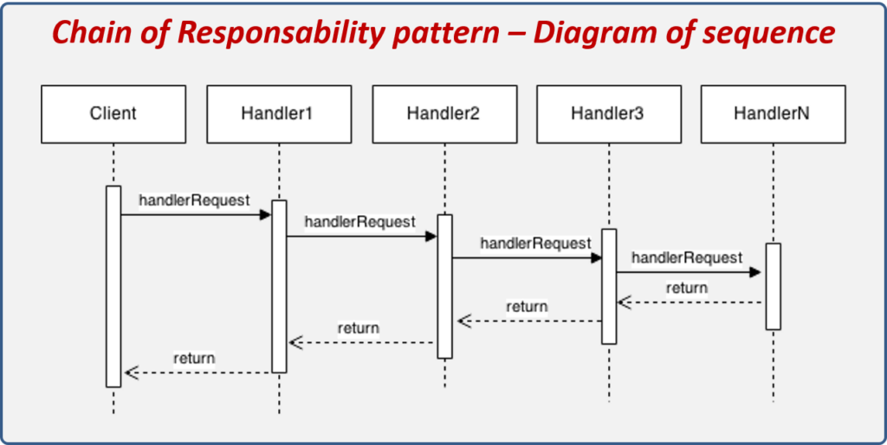

# **`CoR` - _Chain of Responsibility_ - Pattern**



## **Introduction**

**`CoR` Pattern**: Tránh `sự ràng buộc` giữa **người gửi yêu cầu** và **người nhận** bằng cách **cho phép nhiều đối tượng có cơ hội xử lý yêu cầu**

Cụ thể, `CoR` giải quyết bằng cách tạo một chuỗi (`chain`) các **Handlers**. Khi request tới, **Handler-`n`** kiểm tra: _`"Logic của nó có fail không"`_?

- Nếu `CÓ`: Nó chặn đứng request, trả về ngay và không cho request đi qua.
- Nếu `KHÔNG`: Chuyển request tới **Handler-`n+1`**.

Cứ thế cho tới cuối chuỗi.

## **Advantages**

- reduces the coupling.
- adds `flexibility` while **assigning the responsibilities** to objects
- allows a set of classes to **act as one** (hoạt động như **1 thể thống nhất**)
- events produced in one class can be sent to other handler classes with the help of composition.

## **Example Code**

```kotlin
// 1. Data model
data class HttpRequest(val headers: Map<String, String>, val body: String)

// 2. Base Handler (Bộ khung cho mọi handler)
abstract class RequestHandler(private var next: RequestHandler? = null) {

    // Hàm này dùng để móc nối các node lại với nhau
    fun linkWith(nextHandler: RequestHandler): RequestHandler {
        this.next = nextHandler
        return nextHandler
    }

    // Luồng xử lý mặc định
    open fun handle(request: HttpRequest): Boolean {
        if (next == null) {
            return true // Đi đến cuối chuỗi an toàn
        }
        return next!!.handle(request) // Pass cho thằng tiếp theo
    }
}

// 3. Các Concrete Handlers (Thực thi logic cụ thể)
class AuthHandler : RequestHandler() {
    override fun handle(request: HttpRequest): Boolean {
        val token = request.headers["Authorization"]
        if (token != "Bearer TOKENSUPERSECRET") {
            println("AuthHandler: Tạch! Token lởm khởm.")
            return false // Chặn luôn, không pass tiếp
        }
        println("AuthHandler: Token hợp lệ. Pass ->")
        return super.handle(request)
    }
}

class ValidationHandler : RequestHandler() {
    override fun handle(request: HttpRequest): Boolean {
        if (request.body.isBlank()) {
            println("ValidationHandler: Tạch! Body trống rỗng.")
            return false
        }
        println("ValidationHandler: Body có data. Pass ->")
        return super.handle(request)
    }
}

// 4. Client (Cách ông khởi tạo và chạy chuỗi)
fun main() {
    // Cài đặt chuỗi: Auth check trước -> Validation check sau
    val chain = AuthHandler()
    chain.linkWith(ValidationHandler())

    // --- TEST RUN ---
    println("--- Test 1: Bad Auth ---")
    val badAuthReq = HttpRequest(mapOf(), "Order data")
    chain.handle(badAuthReq)
    // Output: AuthHandler: Tạch! Token lởm khởm.

    println("\n--- Test 2: Good Auth, Bad Body ---")
    val badBodyReq = HttpRequest(mapOf("Authorization" to "Bearer TOKENSUPERSECRET"), "")
    chain.handle(badBodyReq)
    // Output: AuthHandler pass -> ValidationHandler Tạch!

    println("\n--- Test 3: Perfect Request ---")
    val goodReq = HttpRequest(mapOf("Authorization" to "Bearer TOKENSUPERSECRET"), "Order data")
    if (chain.handle(goodReq)) {
        println("Server: Chuỗi chạy ngon lành, bắt đầu lưu DB!")
    }
}
```
