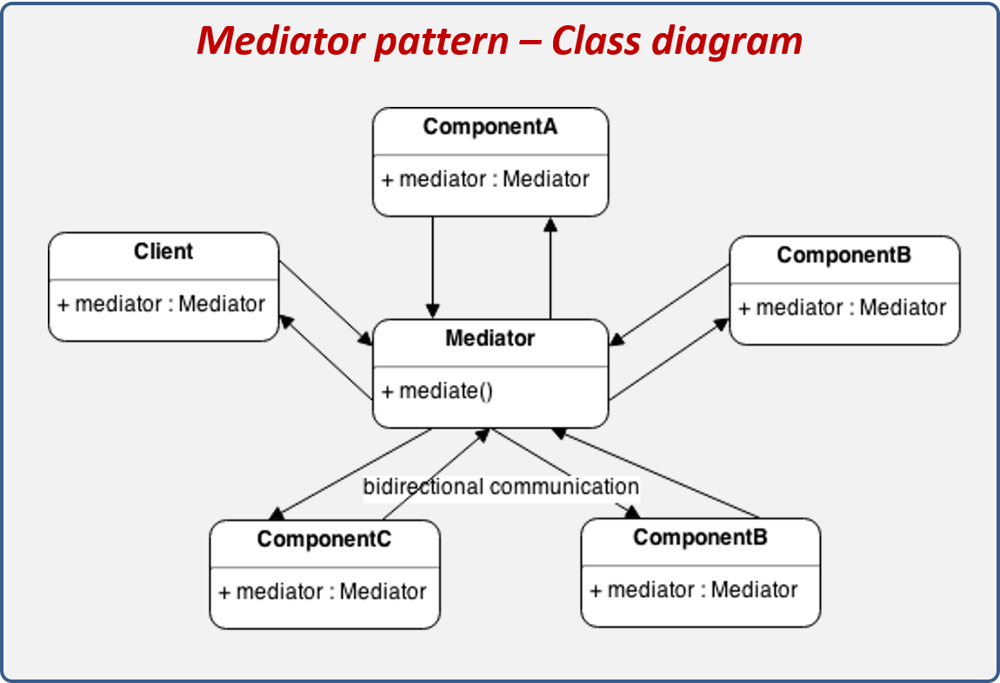

# **`Mediator` Pattern**

## **Introduction**

**`Mediator` Pattern**: điều phối **giao tiếp giữa nhiều object** thông qua một “trung gian” (mediator)

> Các object **không biết nhau**, chỉ biết **Mediator**

**Mediator's workflow**:

- nhận request từ object
- quyết định:
  - gọi **ai**
  - gọi **khi nào**
  - gọi theo **thứ tự** nào

Ex:

- A → ChatRoom (Mediator)
- ChatRoom → gửi tới B, C

## **Advantages**

- **Giảm coupling mạnh** do các object không biết nhau.
- **Dễ maintain** do logic tập trung 1 chỗ.
- **Dễ mở rộng**
- The individual components become simpler and much easier to deal with because they don't need to pass messages to one another. (truyền qua Mediator)

## **Usecases**

- commonly used in **`message-based` systems** likewise chat applications.
- Tập hợp các đối tượng giao tiếp theo những cách phức tạp nhưng được xác định rõ ràng.
