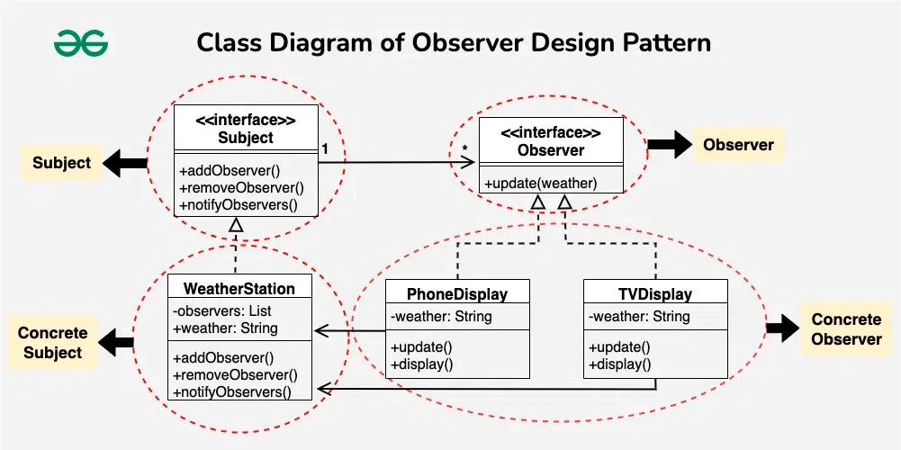

# **`Observer` Pattern**



## **Introduction**

**`Observer` Pattern**: Khi **một object thay đổi trạng thái**, **nhiều object khác cần được cập nhật** tự động mà không cần coupling chặt.

### `Observer` vs `Mediator`

- **Observer**: Mô hình **`Publisher` - `Subcriber` (1-N)**
- **Mediator**: Điều phối **giao tiếp `2 (or nhiều chiều)` giữa các bên**, quan hệ **N-N**

### **Mô hình `Publisher` - `Subcriber`**

- **`Subject` (Publisher)**: Nắm giữ trạng thái (`state`)
  > _Khi trạng thái thay đổi, **Publisher** thực hiện **notify the change** tới **Subcriber**_
- **`Observer` (Subcriber)**: Những bên đăng kí theo dõi (`observer`) **state** từ phía **Publisher**.

**Khác với `Mediator`**, **Subject** không cần biết:

- **Observer** là **ai**, **loại gì** và **làm gì**.

  > _Các **Observer implement common interface (`IObserver`)**, that has **one abstract method (`update()` / `notify()`) handle the received event** from **Publisher**_

  Việc của **Publisher** là duyệt toàn bộ **list observers** và gọi hàm `notify()` (`update()`, ...)

  > _Nhờ vậy, có thể dễ dàng **add/remove observer at runtime**_

- **Mediator** (trung gian) vì mô hình này **không cần Mediator** ở giữa.

---

## **Advantages**

- describes the **coupling** between the **`objects`** and the **`observers`**
- provides the support for **`broadcast-type` communication**.

---

## **Usecases**

- the **`change` of a `state` in `one object`** must be **`reflected` in `another object`** **without** keeping the objects **tight coupled**.
- the framework we writes and needs to be enhanced in future with new observers with minimal changes.

---

## **Advanced: `Event-Driven` Architecture**

Khi `scale` hệ thống từ **Monolith** lên **Microservices**, **`Observer` Pattern** được **tiến hóa** lên thành **`Event-Driven` _Architecture_**.

- **Message Brokers**: Kênh giao tiếp chung (`RabbitMQ`, `Kafka`, ...)
- **Publishers**: send event to broker.
- **Observers** (Subcribers): lắng nghe từ broker và handle khi có event.

---

## **Example Code**

```ts
// typescript

interface Observer {
  update(event: string, data: any): void;
}

class EventBus {
  private listeners: Map<string, Observer[]> = new Map();

  subscribe(event: string, observer: Observer) {
    if (!this.listeners.has(event)) this.listeners.set(event, []);
    this.listeners.get(event)!.push(observer);
  }

  notify(event: string, data: any) {
    this.listeners.get(event)?.forEach((obs) => obs.update(event, data));
  }
}
```

```kotlin
// Kotlin
// Deligates.observable

import kotlin.properties.Delegates

// 1. Định nghĩa kiểu của Listener (Observer) bằng Lambda cho gọn, khỏi cần Interface rườm rà
typealias OnConfigChanged = (property: String, oldValue: String, newValue: String) -> Unit

// 2. Thằng Subject phát sóng
class ConfigManager {
    // Danh sách các thính giả đang subscribe
    private val observers = mutableListOf<OnConfigChanged>()

    fun subscribe(observer: OnConfigChanged) {
        observers.add(observer)
    }

    // Xài Delegates.observable của Kotlin
    // Mỗi khi biến dbUrl bị gán giá trị mới, block code bên trong sẽ TỰ ĐỘNG chạy
    var dbUrl: String by Delegates.observable("jdbc:postgresql://localhost:5432/default_db") { property, old, new ->
        println("\n[ConfigManager] Phát hiện thay đổi! Đang broadcast cho ${observers.size} services...")
        observers.forEach { it(property.name, old, new) }
    }
}
```
