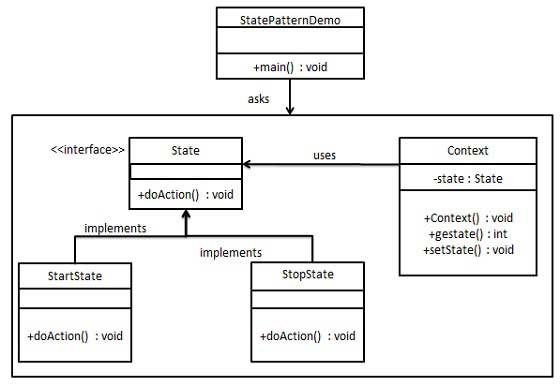

# **`State` Pattern**



## **Introduction**

**`Problem`**: Object **changes the behavior** hoàn toàn **based-on `internal state`**, và tránh dùng `switch/if` khổng lồ.

**`State` Pattern**: Băm **mỗi trạng thái** thành **một Class** riêng biệt.  
Ex: Thay vì object **`Order` tự xử lý logic**:

- nó ủy quyền (**delegate**) **toàn bộ hành vi** cho cái **State object mà nó đang cầm**.
- **Khi trạng thái đổi**, nó đơn giản là vứt object State cũ đi và thay bằng object State mới.

Nhìn từ ngoài vào, Order như thể vừa được "ép kiểu" sang một class khác.

---

## **Advantages**

- keeps the **state-specific behavior**.
- makes any state transitions explicit.

---

## **Usecases**

- the **`behavior` of object** `depends` on `its state` and it must be **able to change its behavior at `runtime`** according to the new state.
- the operations have **large, multipart conditional** statements that **depend on the `state`** of an object. (`if/switch` quá lớn theo state)

---

## **Example Code**

```kotlin
// sealed interface: chỉ class/interface cùng file/module
// mới được implements (or extends) từ nó

// 1. STATE INTERFACE (Đóng gói bằng sealed)
sealed interface OrderState {
    // Các hành vi có thể thực hiện trên state này
    fun pay(context: OrderContext)
    fun ship(context: OrderContext)
    fun cancel(context: OrderContext)
}

// 2. CONCRETE STATES (Mỗi class là một trạng thái, tự ôm logic của riêng nó)

// Trạng thái Chờ thanh toán
class PendingState : OrderState {
    override fun pay(context: OrderContext) {
        println("[State: PENDING] -> Đã nhận tiền! Chuyển trạng thái sang PAID.")
        context.currentState = PaidState() // Đổi state
    }

    override fun ship(context: OrderContext) {
        println("[State: PENDING] -> Lỗi: Chưa trả tiền mà đòi giao hàng à?")
    }

    override fun cancel(context: OrderContext) {
        println("[State: PENDING] -> Đã hủy đơn. Không cần hoàn tiền.")
        context.currentState = CancelledState()
    }
}

// Trạng thái Đã thanh toán
class PaidState : OrderState {
    override fun pay(context: OrderContext) {
        println("[State: PAID] -> Lỗi: Đơn này thanh toán rồi bro!")
    }

    override fun ship(context: OrderContext) {
        println("[State: PAID] -> Đóng gói xong. Bàn giao cho shipper! Chuyển sang SHIPPED.")
        context.currentState = ShippedState()
    }

    override fun cancel(context: OrderContext) {
        println("[State: PAID] -> Đã hủy đơn. Đang tiến hành REFUND tiền lại cho khách...")
        context.currentState = CancelledState()
    }
}

// Trạng thái Đã giao (End state)
class ShippedState : OrderState {
    override fun pay(context: OrderContext) = println("Đã giao rồi, pay gì nữa.")
    override fun ship(context: OrderContext) = println("Hàng đang trên đường rồi.")
    override fun cancel(context: OrderContext) = println("Lỗi: Hàng đã xuất kho, đéo cho hủy nữa!")
}

// Trạng thái Đã hủy (End state)
class CancelledState : OrderState {
    override fun pay(context: OrderContext) = println("Đơn đã hủy, bỏ đi ông.")
    override fun ship(context: OrderContext) = println("Đơn đã hủy, không thể giao.")
    override fun cancel(context: OrderContext) = println("Hủy cmnr còn đòi hủy gì nữa.")
}

// 3. CONTEXT (Thằng nắm giữ State hiện tại)
class OrderContext {
    // Khởi tạo luôn ở Pending
    var currentState: OrderState = PendingState()

    // Ủy quyền toàn bộ request xuống cho State hiện tại xử lý
    fun processPayment() = currentState.pay(this)
    fun dispatchOrder() = currentState.ship(this)
    fun cancelOrder() = currentState.cancel(this)
}

// 4. CLIENT GỌI CODE
fun main() {
    val order = OrderContext()

    println("--- Kịch bản 1: Mua hàng bình thường ---")
    order.dispatchOrder() // Cố tình giao khi chưa pay -> Báo lỗi
    order.processPayment() // Trả tiền -> Chuyển sang Paid
    order.dispatchOrder() // Giao hàng -> Chuyển sang Shipped

    println("\n--- Kịch bản 2: Đòi hủy sau khi đã ship ---")
    order.cancelOrder() // Cố tình hủy khi đang Shipped -> Báo lỗi
}
```
