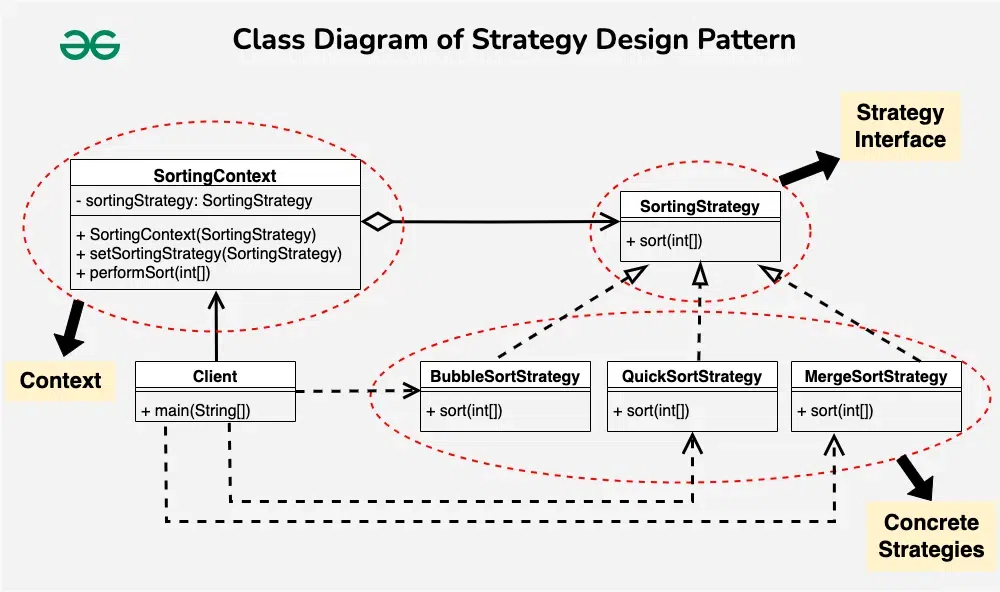

# **`Strategy` Pattern**



## **Introduction**

**`Prob`**:

- Có **nhiều cách** thực hiện **cùng một tác vụ**
- Muốn **chọn thuật toán lúc runtime** mà **không dùng `if/else` dài**.

**`Strategy` Pattern**:

- **defines a family of functionality**: Đóng gói một **họ các thuật toán** (các cách giải quyết cùng một vấn đề) thành các class riêng biệt
- **make them interchangeable**: Làm cho chúng có thể thay thế (`interchangeable`) cho nhau ở **runtime**.

---

## **Advantages**

- provides a substitute to subclassing.
- defines **each behavior within its own class**, **eliminating** the need for **conditional statements**.
- **easier to extend** and incorporate new behavior without changing the application

---

## **Usecase**

- the **multiple classes differ only in their behaviors**.

  e.g. `Servlet API`, `Payment API`, ...

- different variations of an algorithm.

---

## **Example Code**

```ts
// typescript

interface SortStrategy {
  sort(data: number[]): number[];
}

class Sorter {
  constructor(private strategy: SortStrategy) {}

  setStrategy(strategy: SortStrategy) {
    this.strategy = strategy;
  }
  sort(data: number[]) {
    return this.strategy.sort(data);
  }
}

// Dùng:
const sorter = new Sorter(new QuickSort());
sorter.setStrategy(new MergeSort()); // swap runtime
```

```kotlin
// Kotlin
// SpringBoot

// --- 1. STRATEGY INTERFACE ---
interface PaymentStrategy {
    fun supportType(): String // Hàm này dùng để định danh Strategy
    fun processPayment(amount: Long)
}

// --- 2. CONCRETE STRATEGIES (Các thuật toán cụ thể) ---
@Component
class MomoStrategy : PaymentStrategy {
    override fun supportType() = "MOMO"

    override fun processPayment(amount: Long) {
        println("=> [Momo API] Đang tạo QR Code cho số tiền $amount VND...")
        // Logic gọi sang server Momo nằm hết ở đây
    }
}

@Component
class ZaloPayStrategy : PaymentStrategy {
    override fun supportType() = "ZALOPAY"

    override fun processPayment(amount: Long) {
        println("=> [ZaloPay API] Đang redirect user sang app ZaloPay cho đơn $amount VND...")
        // Logic của ZaloPay nằm ở đây
    }
}

// --- 3. CONTEXT (Thằng điều phối) ---
@Service
class CheckoutService(
    // MA THUẬT CỦA SPRING Ở ĐÂY:
    // Nó tự động gom tất cả các class implement PaymentStrategy vào cái List này.
    strategies: List<PaymentStrategy>
) {
    // Biến List thành Map để tra cứu cực nhanh: Map<"MOMO", MomoStrategy>
    private val strategyMap: Map<String, PaymentStrategy> = strategies.associateBy { it.supportType() }

    fun checkout(method: String, amount: Long) {
        // Lấy Strategy tương ứng ra xài ở runtime
        val strategy = strategyMap[method.uppercase()]
            ?: throw IllegalArgumentException("Hệ thống đéo hỗ trợ cổng thanh toán: $method")

        println("[CheckoutService] Đã nhận đơn, ủy quyền xử lý cho Strategy...")
        strategy.processPayment(amount)
    }
}
```
