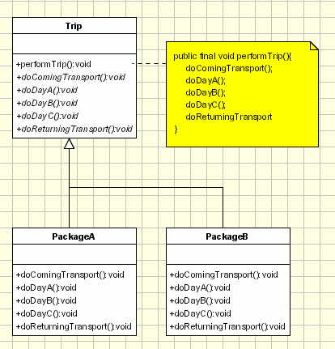

# **`Template` Pattern (`Template Method`)**



## **Introduction**

**`Prob`**:

- **Baseclass**: Định nghĩa skeleton của một thuật toán
- **Subclass**: override các bước cụ thể.

**`Template Method` Pattern**: Định nghĩa **`cấu trúc cơ bản`** của một hàm trong một phép toán, **`chuyển giao một số bước cho các lớp con`** của nó

**`Principle`**:

- **Subclasses** chỉ được phép **thay đổi chi tiết của từng bước**, **TUYỆT ĐỐI KHÔNG** được làm **thay đổi `cấu trúc` hoặc `thứ tự chạy` của thuật toán tổng thể** do class cha đã vạch ra.
- **Hollywood Principle**: `"don't call us, we call you"`
  > _Tức là class con không có quyền quyết định lúc nào hàm của nó được chạy. Class cha cầm trịch luồng chính, và nó sẽ "gọi xuống" class con ở những chỗ cần thiết._

---

## **`Strategy` vs `Template`**

- **Strategy** (Dựa trên `Interface - Composition`): "Tao giao việc cho mày, mày muốn làm sao thì làm, tao chỉ cần kết quả". (**Cho phép đổi toàn bộ thuật toán**).
- **Template** (Dựa trên `Abstract Class - Inheritance`): "Tao vạch sẵn quy trình 3 bước A -> B -> C. Mày kế thừa tao thì mày phải tự code cách làm bước B và C, nhưng **thứ tự chạy bắt buộc** vẫn phải là A rồi mới tới B rồi mới tới C".

---

## **Advantages**

- for reusing the code
- kiểm soát luồng chạy

---

## **Usecases**

- the common behavior among sub-classes should be moved to a single common class by avoiding the duplication. (**reusing behavior**)

---

## **Example Code**

```ts
// typescript
abstract class DataParser {
  // Template method — không override
  parse(filePath: string): void {
    const raw = this.readFile(filePath); // bước 1
    const data = this.parseData(raw); // bước 2 — abstract
    this.validateData(data); // bước 3 — hook (optional)
    this.saveToDatabase(data); // bước 4
  }

  abstract parseData(raw: string): any[];

  // Hook method — subclass có thể override hoặc không
  validateData(data: any[]): void {}

  private readFile(path: string): string {
    /* ... */ return "";
  }
  private saveToDatabase(data: any[]): void {
    /* ... */
  }
}

class CSVParser extends DataParser {
  parseData(raw: string) {
    return raw.split("\n").map((l) => l.split(","));
  }
}

class JSONParser extends DataParser {
  parseData(raw: string) {
    return JSON.parse(raw);
  }
}
```

```kotlin
// kotlin

// --- 1. ABSTRACT CLASS (Thằng vạch ra luật chơi) ---
abstract class BaseDataImporter {

    // ĐÂY LÀ TEMPLATE METHOD.
    // Trong Kotlin, hàm này mặc định là final, subclass không thể ghi đè (override) được.
    fun executeImport(filePath: String) {
        println("\n--- Bắt đầu quy trình import ---")
        val rawData = readFile(filePath)

        val entities = parseData(rawData) // Gọi xuống subclass

        if (validate(entities)) { // Gọi xuống subclass (nếu có)
            saveToDatabase(entities)
            println("=> Import thành công!")
        } else {
            println("=> Import thất bại do data lởm!")
        }
    }

    // Các bước dùng chung (Base class tự làm)
    private fun readFile(path: String): List<String> {
        println("1. [Base] Đang tải file từ: $path")
        return listOf("row1_data", "row2_data") // Mock data
    }

    private fun saveToDatabase(data: List<Any>) {
        println("4. [Base] Đang bulk insert ${data.size} records vào Database...")
    }

    // --- HOOK METHOD (Phương thức móc nối) ---
    // Class con CÓ THỂ override nếu muốn, không thì xài mặc định của cha
    open fun validate(data: List<Any>): Boolean {
        println("3. [Base Hook] Validate mặc định: Pass hết, đéo cần check!")
        return true
    }

    // --- ABSTRACT METHOD ---
    // Class con BẮT BUỘC phải tự implement
    abstract fun parseData(rawData: List<String>): List<Any>
}

// --- 2. CÁC CONCRETE CLASSES (Bọn điền phần ruột) ---
class CsvUserImporter : BaseDataImporter() {
    // Bắt buộc phải code cái này vì mỗi file một kiểu map data
    override fun parseData(rawData: List<String>): List<Any> {
        println("2. [CSV Importer] Đang băm chuỗi theo dấu phẩy ',' để tạo User Entity...")
        return listOf("User_A", "User_B")
    }

    // Ghi đè Hook method vì muốn rule khắt khe hơn
    override fun validate(data: List<Any>): Boolean {
        println("3. [CSV Hook] Đang check xem có user nào bị trùng email trong DB không...")
        return true
    }
}

class ExcelProductImporter : BaseDataImporter() {
    override fun parseData(rawData: List<String>): List<Any> {
        println("2. [Excel Importer] Đang đọc từng cell trong sheet để tạo Product Entity...")
        return listOf("Product_X", "Product_Y")
    }
    // Không override hook validate, dùng luôn của class cha
}
```
