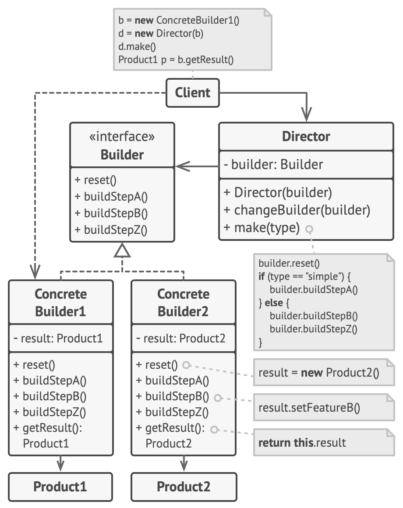

# **`Builder` Pattern**



## **`1.` Builder Pattern**

### **Bản chất**

**`Builder` Pattern**: Xây dựng một đối tượng phức tạp từ các đối tượng đơn giản bằng phương pháp từng bước.

**Mục đích**: Tách rời quá trình xây dựng một đối tượng phức tạp ra khỏi phần biểu diễn của nó, cho phép cùng một quy trình xây dựng tạo ra các biểu diễn khác nhau.

### **Advantages**

- Phân tách rõ ràng giữa quá trình xây dựng và
  biểu diễn một đối tượng.
- Kiểm soát tốt hơn quá trình xây dựng.
- Hỗ trợ thay đổi biểu diễn nội bộ của các đối tượng.
- Khắc phục triệt để anti-pattern **Telescoping Constructor** (khi một class có quá nhiều constructor với các param khác nhau). Thường implement thông qua `Method Chaining`

### **Usecases**

- object can't be created in single step like in the de-serialization of a complex object
- object cần khởi tạo có nhiều thuộc tính optional
- quá trình khởi tạo cần nhiều bước theo thứ tự.

---

## **`2.` Implementation**

```java
public class HttpRequest {
    private final String url;
    private final String method;
    private final Map<String, String> headers;
    private final String body;

    private HttpRequest(Builder builder) {
        this.url = builder.url;
        this.method = builder.method;
        this.headers = builder.headers;
        this.body = builder.body;
    }

    public static class Builder {
        private String url;
        private String method = "GET";
        private Map<String, String> headers = new HashMap<>();
        private String body;

        public Builder url(String url) {
            this.url = url;
            return this;
        }
        public Builder method(String method) {
            this.method = method;
            return this;
        }
        public Builder header(String key, String value) {
            headers.put(key, value);
            return this;
        }
        public Builder body(String body) {
            this.body = body;
            return this;
        }
        public HttpRequest build() {
            return new HttpRequest(this);
        }
    }
}

// Sử dụng
HttpRequest request = new HttpRequest.Builder()
    .url("https://api.example.com/users")
    .method("POST")
    .header("Content-Type", "application/json")
    .body("{\"name\": \"Alice\"}")
    .build();
```
