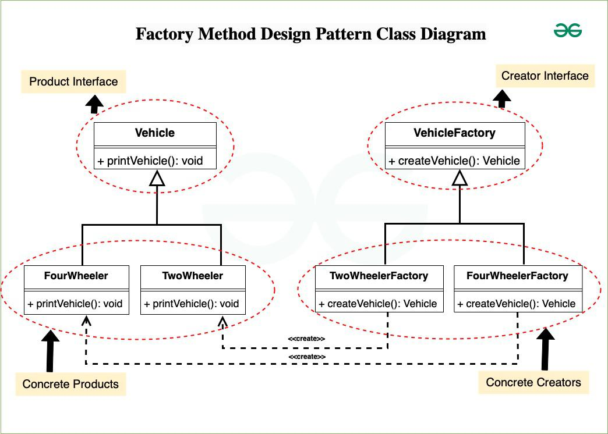

# **`Factory Method` Pattern**



## **`1.` Factory Method Concept**

### **Bản chất**:

Nâng cấp từ **Simple Factory** để giải quyết bài toán `OCP`, thay vì dùng một class Factory duy nhất ôm đồm mọi thứ thì:

- Định nghĩa một `interface` hoặc `abstract-class` để tạo đối tượng nhưng cho **phép các lớp con quyết định lớp nào sẽ được khởi tạo**. (`Factory`)
- Khi này, việc quyết định instantiate class cụ thể nào sẽ được defer (giao phó) cho các `subclasses`(`ConcreteFactory`)

### **Advantages**:

- Allows the sub-classes to **choose the type of objects** to create
- Promotes the `loose-coupling` by eliminating the need to bind application-specific classes into the code.

### **Usecases**:

- a class doesn't know what sub-classes will be required to create
- a class wants that its **sub-classes `specify` the objects to be created**
- the parent classes choose the creation of objects to its sub-classes

---

## **`2.` Implementation.**

```kotlin
/* ========================================
* Product Interface
======================================== */
interface PaymentGateway {
    fun processPayment(amount: Double)
}

// Concrete Products
class StripeGateway : PaymentGateway {
    override fun processPayment(amount: Double) = println("Processing $amount via Stripe")
}
class VNPayGateway : PaymentGateway {
    override fun processPayment(amount: Double) = println("Processing $amount via VNPay")
}

/* ========================================
* Factory
======================================== */
// Factory Interface / Creator
abstract class PaymentProcessor {
    // Factory Method
    protected abstract fun createGateway(): PaymentGateway

    // Core business logic
    fun executeCheckout(amount: Double) {
        val gateway = createGateway() // Gọi Factory method thay vì gọi new()
        // Các logic validation, logging, saving to DB trước khi process...
        gateway.processPayment(amount)
    }
}

// Concrete Factories (Concrete Creators)
class StripeProcessor : PaymentProcessor() {
    override fun createGateway(): PaymentGateway = StripeGateway()
}
class VNPayProcessor : PaymentProcessor() {
    override fun createGateway(): PaymentGateway = VNPayGateway()
}
```