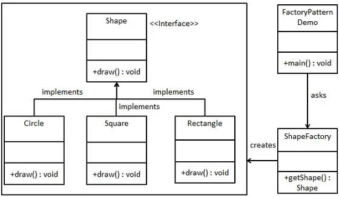

# **`Factory` Pattern**

## **`1.` _Simple_ Factory**

> _**Simple Factory** không phải là một pattern chính thức, nhưng nó là nền tảng tư duy cho 2 pattern còn lại._



### **Bản chất**

- Đẩy toàn bộ logic tạo object (thường là một đống `if/else` hoặc `switch-case`/`when`) vào một class (`Factory`) hoặc một static method duy nhất
- Vi phạm `OCP` của `SOLID` khi muốn thêm 1 loại object mới phải sửa của class factory.

### **Example**

```kotlin
// Product Interface
interface PaymentGateway {
    fun processPayment(amount: Double)
}

// Concrete Products
class StripeGateway : PaymentGateway {
    override fun processPayment(amount: Double) = println("Processing $amount via Stripe")
}
class VNPayGateway : PaymentGateway {
    override fun processPayment(amount: Double) = println("Processing $amount via VNPay")
}

// The Simple Factory
object PaymentFactory {
    fun createGateway(type: String): PaymentGateway {
        return when (type.uppercase()) {
            "STRIPE" -> StripeGateway()
            "VNPAY" -> VNPayGateway()
            else -> throw IllegalArgumentException("Unsupported Gateway")
        }
    }
}
```

---

## **`2.` [Factory Method](./FactoryMethod.md)**a

## **`3.` [Abstract Factory](./AbstractFactory.md)**
