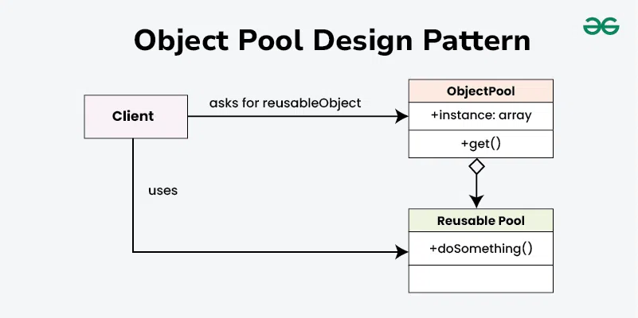

# **`Object Pool` Pattern.**

Details: https://www.geeksforgeeks.org/java/object-pool-design-pattern/

### **Object Pool**

Thay vì

- khởi tạo (allocation)
- dọn dẹp (garbage collection)

object liên tục mỗi khi cần, tao tạo sẵn một "hồ chứa" (pool) với một số lượng object nhất định.

**Khi client cần, nó sẽ mượn (`acquire`) một object từ pool. Dùng xong, nó không hủy đi mà trả lại (`release`) vào pool để thằng khác dùng tiếp.**

### Advantages

- boosts the performance of the application significantly.
- `most effective` in a situation where the `rate of initializing a class instance is high`. (**Khởi tạo instance quá nhiều hoặc cost khởi tạo quá lớn**)
- manages the connections and provides a way to reuse and share them.
- can also provide the limit for the maximum number of objects that can be created.

### **Usecases**

- Pattern này là "cứu cánh" khi **`chi phí` để tạo một object mới là `quá đắt đỏ`** về mặt CPU, RAM, hoặc Network IO.
  > Điển hình nhất là: Database Connections, Threads, hoặc Socket Connections.
- there are several clients who need the same resource at different times. (`Initialize` instance with `high rate`)
