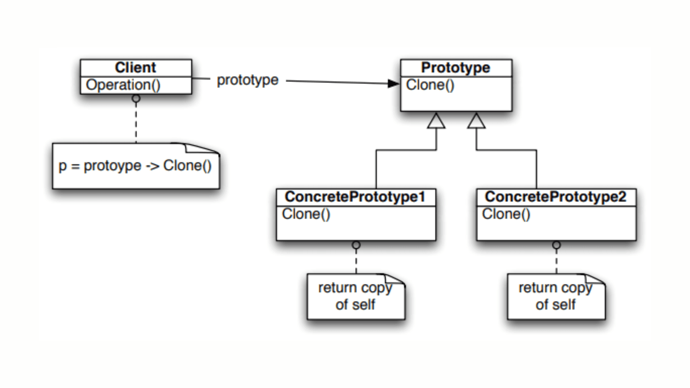

# **`Prototype` Pattern**



## **`1.` `Prototype` Pattern**

### **Bản chất**

**`Prototype` Pattern**: Tạo `đối tượng mới` bằng cách sao chép (`clone`) một `đối tượng đã tồn tại`, thay vì khởi tạo từ đầu (also be **customized** as per the requirement).

Đòi hỏi object phải **implement một clone interface**.  
**Kĩ thuật quan trọng** nhất ở đây là phải phân biệt và xử lý đúng giữa:

- `Shallow Copy` (chỉ copy reference)
- `Deep Copy` (copy toàn bộ object tree bọc bên trong).

### **Advantages**:

- Hiệu quả khi chi phí khởi tạo object bằng hàm `constructor` là quá đắt đỏ:
  - tốn resource CPU
  - cần call database
  - hoặc thực hiện I/O operation nặng nề
- reduces the need of `sub-classing` -> **clone** + **customize**.
- hides complexities of creating objects.
- The clients can get new objects without knowing which type of object it will be. (**Loosely Coupling**)
- lets you add or remove objects at runtime. (dùng `Map<key, type> registry` để quản lý prototype)

### **Usecases**

- the classes are `instantiated at runtime`.
- the `cost of creating an object` is **expensive** or **complicated**.
- want to **keep the `number of classes` in an application `minimum`**.
- the client application

---

## **`2.` Implementation**

```kotlin
// Nested Object
data class AccessLevel(var roleName: String, var privileges: MutableList<String>)

// Prototype Object
data class UserConfig(
    var username: String,
    var theme: String,
    var access: AccessLevel
) {
    // Tự implement Deep Copy để đảm bảo an toàn data
    fun deepCopy(): UserConfig {
        // Clone lại toàn bộ state của nested object
        val clonedPrivileges = this.access.privileges.toMutableList()
        val clonedAccess = AccessLevel(this.access.roleName, clonedPrivileges)

        return UserConfig(this.username, this.theme, clonedAccess)
    }
}

fun main() {
    val originalAccess = AccessLevel("ADMIN", mutableListOf("READ", "WRITE"))
    val originalConfig = UserConfig("johndoe", "DARK", originalAccess)

    // 1. Dùng Shallow Copy mặc định của Kotlin
    val shallowClone = originalConfig.copy(theme = "LIGHT")

    // 2. Dùng Deep Copy tự viết
    val deepClone = originalConfig.deepCopy()
    deepClone.theme = "LIGHT"

    // TEST: Thử hack đổi quyền của shallow clone
    shallowClone.access.roleName = "SUPER_ADMIN"
    shallowClone.access.privileges.add("DELETE")

    // TEST: Đổi quyền của deep clone
    deepClone.access.roleName = "GUEST"

    println("Original Role: ${originalConfig.access.roleName}") // Kết quả: SUPER_ADMIN -> Bản gốc bị dính đòn vì Shallow copy!
    println("Original Privileges: ${originalConfig.access.privileges}") // Kết quả: [READ, WRITE, DELETE] -> Bị mutate data!
}
```

> _Thực thế, **Prototype Pattern** khá ít được sử dụng_
