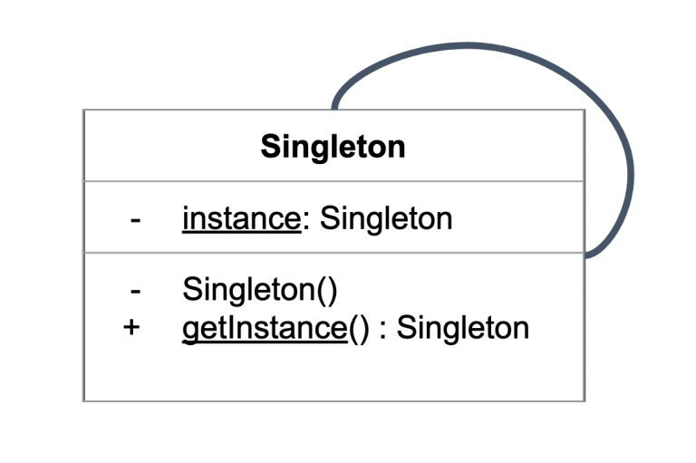

# **`Singleton` Pattern**

## **`1.` Singleton**



### **Purpose**:

- Đảm bảo **`một class` chỉ có `duy nhất một instance`** (thực thể) được tạo ra **trong suốt quá trình app chạy**.
- Cung cấp **một điểm chung duy nhất để truy cập** - `global access point` - vào instance đó.

### **Advantages**

- Saves memory because **object is not created** at **each request**. Only `single instance` is **reused again and again**.

### **Usecase**:

> _mostly used in multi-threaded and database applications_

- DB Connection (Pool)
- Logger
- Configuration Manager: Object đọc **file config** (`.env`, `config.json`) lúc khởi động app. Bất cứ đâu trong code cần lấy config đều gọi đến object này thay vì đọc lại file.
- Service dùng chung
- Cache

### **Key points**:

- `private` constructor
- `private static field` that holds the this class's instance
- `public static method` to get the instance

### **Disadvantages**

- Trong môi trường `multi-thread`, cần xử lý `thread-safety` (dùng synchronized hoặc double-checked locking).
- Singleton cũng bị chỉ trích vì làm cho unit testing khó hơn do tạo ra **global state**.

## **`2.` Implementations**

- #### `Java`

  ```java
  /* ========================================
  * NOT THREAD-SAFE SINGLETON
  ======================================== */
  public class Singleton {
      // private static field
      private static Singleton instance;

      // private constructor
      private Singleton() {}

      // public static method to get the instance
      public static Singleton getInstance() {
          if (instance == null) {
              instance = new Singleton();
          }
          return instance;
      }
  }

  /* ========================================
  * Thread-safe singleton + higher performance
  ======================================== */
  public class Singleton {
      // volatile: biến tranh chấp
      //  + Visibility: thread khác thấy giá trị mới nhất
      private static volatile Singleton instance;

      private Singleton() {}

      // không synchronized method -> không lock mỗi lần gọi
      public static Singleton getInstance() {
          if (instance == null) {
              // nếu chưa có instance
              // => lock class + synchronized method
              //  -> thread khác muốn dùng class thì phải đợi
              synchronized (Singleton.class) {
                  if (instance == null) { // double checking
                  // khi cả 2 thread đều vào tới đây,
                  // và tất nhiên 1 thread đã tạo được instance trước đó
                  // nên cần Double-Checked Locking - DCL
                      instance = new Singleton();
                  }
              }
          }
          return instance;
      }
  }

  /* ========================================
  * ENUM class
  * Đảm bảo:
      - JVM không tạo thêm instance
      - Không bị phá bởi reflection
  ======================================== */
  public enum Singleton {
      INSTANCE; // object của class Singleton

      // vẫn có method như thường
      public void sayHello() {
          System.out.println("Hello");
      }
  }
  ```

- #### `Kotlin`

  ```kotlin
  /* ========================================
  * Sử dụng object
  ======================================== */
  object Singleton {
      fun doSomeThing() {
          println("Helloworld")
      }
  }
  // thread-safe, lazy init...


  /* ========================================
  * Companion Object
  ======================================== */
  class Singleton private constructor() {
      companion object {
          val instance: Singleton by lazy { Singleton() }
      }
  }
  ```

- #### Example: [DB ConnectionPool](./dbconnectionpool/)
