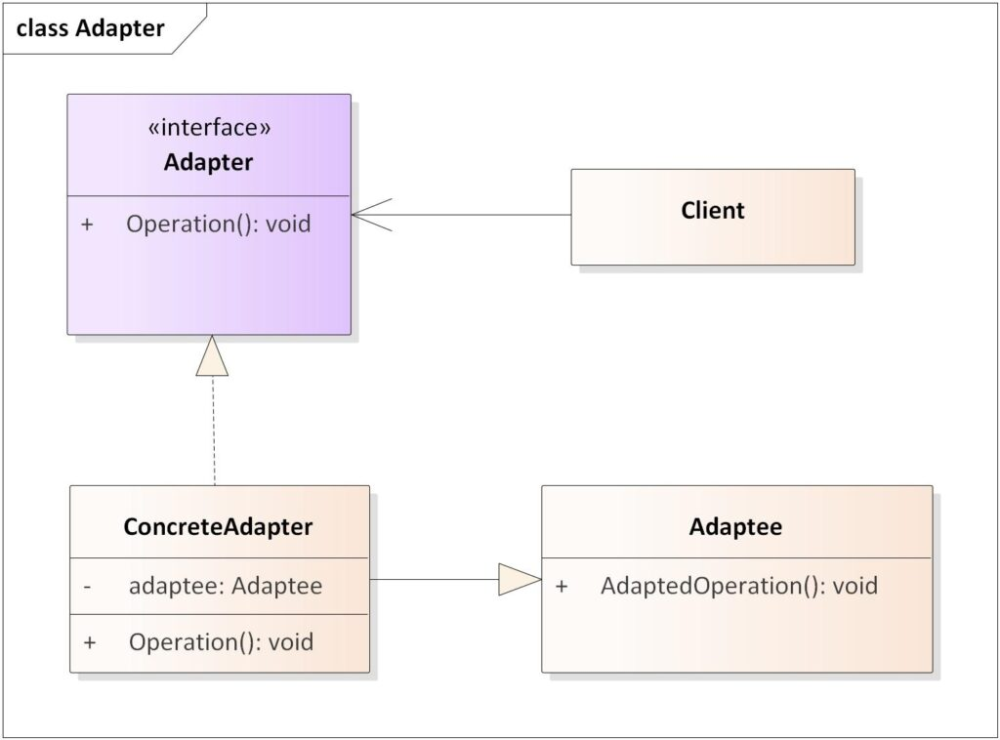

# **`Adapter` Pattern**



## **`1.` Adapter (Wrapper) Pattern**

### **Bản chất**

**`Adapter` Pattern**: Convert `interface của một class` thành một `interface khác` mà **client đang mong đợi**. Adapter giúp các class có interface "lệch pha" hoàn toàn có thể làm việc chung với nhau mà không cần đụng vào source code gốc của chúng

### **Cấu trúc**

- **Target**: Interface mà client mong đợi (ex: `UserRepository`)
- **Client**: Tương tác với Target interface. (ex: `UserService`)
- **Adaptee**: Thư viện third-party, legacy code, hoặc service bên ngoài có interface khác hoàn toàn, chứa logic hữu ích nhưng ông không thể gọi trực tiếp. (ex: `UserJpaRepository`)
- **Adapter**: Class đứng giữa
  - `implements` **Target** interface.
  - chứa instance của **Adaptee**

  Khi **Client** gọi method của **Target**, **Adapter** sẽ **translate request** đó và gọi method của **Adaptee**

---

```kotlin
// 1. Target: Interface chuẩn mực của domain model bro đang thiết kế
interface ModernPaymentProcessor {
    fun processPayment(customerId: String, amountVnd: Long)
}

// 2. Adaptee: Thư viện Legacy của bên thứ 3 (Lệch pha hoàn toàn)
class LegacyStripeApi {
    fun makeStripeCharge(usdAmount: Double, stripeToken: String, userEmail: String) {
        println("=> [Stripe API] Đã charge thành công $usdAmount USD cho $userEmail với token: $stripeToken")
    }
}

// 3. Adapter: Kẻ "phiên dịch"
// Trong Spring Boot, bro đánh dấu class này là @Service hoặc @Component
class StripePaymentAdapter(
    private val legacyStripeApi: LegacyStripeApi // Composition: Chứa Adaptee bên trong
) : ModernPaymentProcessor {

    private val exchangeRate = 25000.0 // Giả lập tỉ giá

    // Implement method của Target
    override fun processPayment(customerId: String, amountVnd: Long) {
        // --- Bắt đầu quá trình "phiên dịch" (Translation) ---

        // a. Convert Data: VNĐ sang USD
        val amountUsd = amountVnd / exchangeRate

        // b. Tra cứu thêm thông tin thiếu (nếu Adaptee cần)
        val dummyEmail = "$customerId@company.com"
        val generatedToken = "TOKEN_${System.currentTimeMillis()}"

        println("[Adapter] Đang convert $amountVnd VNĐ thành $amountUsd USD...")

        // c. Delegate (Ủy quyền) cho Adaptee thực thi
        legacyStripeApi.makeStripeCharge(amountUsd, generatedToken, dummyEmail)
    }
}

// 4. Client Layer (Ví dụ: OrderService)
class CheckoutService(private val paymentProcessor: ModernPaymentProcessor) {
    fun checkoutCart(cartId: String, totalVnd: Long) {
        println("--- Bắt đầu thanh toán giỏ hàng $cartId ---")
        // Client hoàn toàn không biết sự tồn tại của LegacyStripeApi
        paymentProcessor.processPayment("USER_888", totalVnd)
    }
}
```
