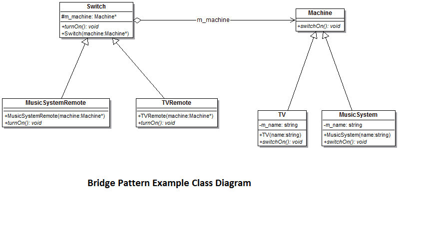

# **`Bridge` Pattern**

### **Problem: `Combinatorial Explosion`**:

Giả sử, Notification system có:

- **Notification Type**: OTP, Alert, Marketing, ...
- **Notification Channel**: SMS, Email, Push Notification, ...

Nếu `inheritance`, ta sẽ có: `OtpSms`, `OtpEmail`, `AlertSms`, ...

Khi này, **Càng mở rộng, cấu trúc class càng phình to theo cấp số nhân, bảo trì cực kỳ mệt mỏi.**

### **Composition over Inheritance**:

Chia inheritance thành 2 thành phần:

- **Abstraction**: Cây định nghĩa _**Cái gì**_ (đại diện cho **Notification Type**).
- **Implementation**: Cây định nghĩa _**Làm như thế nào**_ (đại diện cho **Notification Channel**)

**`Bridge`** là việc cho **Abstraction** chứa (`composition`) một **`reference`** tới **interface of Implementation class**

> Nhờ vây, số lượng Class giảm từ `MxN` xuống còn `M+N`

---

## **`Bridge` Pattern**



### **Bản chất**

**`Bridge` Pattern** cho phép tách rời :

- sự trừu tượng chức năng khỏi (logic cấp cao)
- phần triển khai cụ thể (phần thực thi cụ thể)

để hai phần này có thể thay đổi độc lập, giúp dễ scale 2 chiều.

### **Advantages**

- enables the separation of `implementation` from the interface (`abstraction`). => **Loose Coupling: Implementation thay đổi không ảnh hưởng tới Abstraction**
- improves the extensibility. (tăng khả năng mở rộng)
  - Thêm **Abstraction** mới -> không ảnh hưởng **Implementation**.
  - Thêm **Implementation** mới -> không ảnh hưởng **Abstraction**.
- allows the **hiding of implementation details** from the client.

### **Usecases**

- Không muốn có sự **ràng buộc** vĩnh viễn giữa sự trừu tượng chức năng (`Abstraction`) và phần triển khai (`Implementation`) của nó.
- Cả **Abstraction** và **Implementation** đều cần được `scale` bằng cách **sử dụng các lớp con**.
- Chủ yếu được sử dụng ở những nơi mà các thay đổi được thực hiện trong **Implementation** không ảnh hưởng đến phía clients.

### **`Bridge`** vs **`Adapter`**

- **Bridge**: Dùng để **_thiết kế chủ động_**
  > Nó được phác thảo **ngay từ lúc kiến trúc sư đặt bút vẽ system architecture**, nhằm đảm bảo Abstraction và Implementation có thể scale độc lập về sau mà không làm nứt gãy hệ thống
- **Adapter**: Dùng để xử lý **_sự đã rồi_**
  > Khi có 2 module cũ đã viết xong nhưng interface không khớp nhau, nhét Adapter vào giữa để chúng nói chuyện được

### **Example Code**

```kotlin
// --- NHÁNH 1: Implementation (Làm như thế nào?) ---
// Interface định nghĩa quy chuẩn cho các kênh gửi
interface MessageSender {
    fun sendMessage(title: String, body: String)
}

// Các concrete implementation
class SmsSender : MessageSender {
    override fun sendMessage(title: String, body: String) {
        println("[SMS] Đang gửi tới số điện thoại: $title - $body")
    }
}

class EmailSender : MessageSender {
    override fun sendMessage(title: String, body: String) {
        println("[Email] Đang gửi qua Mailgun: $title - $body")
    }
}

// --- NHÁNH 2: Abstraction (Cái gì?) ---
// Lớp này giữ cái "Bridge" (biến sender) để nối sang nhánh Implementation
abstract class Notification(protected val sender: MessageSender) {
    abstract fun notifyUser()
}

// Các loại thông báo cụ thể
class OtpNotification(
    sender: MessageSender,
    private val otpCode: String
) : Notification(sender) {

    override fun notifyUser() {
        val title = "Mã xác thực"
        val body = "Mã OTP của ông là $otpCode. Tuyệt đối không chia sẻ."
        sender.sendMessage(title, body) // Delegate (Ủy quyền) việc gửi cho MessageSender
    }
}

class UrgentAlertNotification(
    sender: MessageSender,
    private val errorLog: String
) : Notification(sender) {

    override fun notifyUser() {
        val title = "CẢNH BÁO ĐỎ"
        val body = "Hệ thống đang lỗi nặng: $errorLog"
        sender.sendMessage(title, body)
    }
}

// --- Client Code (Nơi lắp ráp ở Runtime) ---
fun main() {
    val sms = SmsSender()
    val email = EmailSender()

    // Lắp ráp tự do: OTP gửi qua SMS
    val loginOtp = OtpNotification(sms, "123456")
    loginOtp.notifyUser()

    // Lắp ráp tự do: Cảnh báo lỗi gửi qua Email
    val serverDownAlert = UrgentAlertNotification(email, "NullPointerException at line 42")
    serverDownAlert.notifyUser()
}
```
