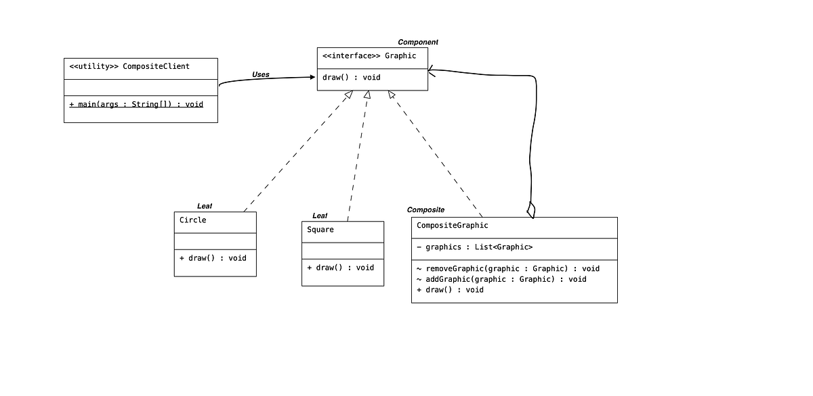

# **`Composite` Pattern**



## **`Composite` Pattern**

**`Composite` Pattern** sinh ra để trị đặc trị những **bài toán có dữ liệu phân cấp theo cấu trúc cây** (`Tree structure`).

#### **Components**

- **`Component`** (Interface / Abstract class): Định nghĩa các **operation chung** cho cả Leaf và Composite.
- **`Leaf`**: Khối **`building block` cơ bản nhất**. Nó thực thi logic thực sự và không chứa bất kỳ component nào bên trong.
- **`Composite`**: Đóng vai trò là `co*ntainer`, chứa một **danh sách các Component** (có thể là **Leaf** hoặc lại là một **Composite** khác).

#### **Problems**

Code của client thường phải dùng `if/else` hoặc `is/instanceof` để phân biệt xem đang thao tác với:

- Leaf: một object đơn lẻ
- Composite: một danh sách các object

#### **Composite Pattern _solve_ this Problem**

Tạo `common interface` mà cả **Leaf** và **Composite** đều phải **implements** => **Component**. Khi này:

- **Component** định nghĩa Operations chung
- **Leaf** (`implement Component`): object trực tiếp triển khai các Operations đó
- **Composite** (`implement Component`): triển khai Operations đó bằng cách **duyệt qua list component** và **gọi Operations ở từng phần tử**.

### **Bản chất Composite Pattern**

Cho phép clients **thao tác một cách `tổng quát`** trên các object có thể (**Composite**) hoặc không thể (**Leaf**) represent a hierarchy of objects.

### **Advantages**

- defines **class hierarchies** (**abstract**, `component`) that contain primitive (`leaf`) and complex objects (`composite`).
- makes easier to you to add new kinds of components.
- provides `flexibility of structure` with manageable class or interface

### **Usecases**

- want to represent a full or partial hierarchy of objects.
- the responsibilities are needed to be added dynamically to the individual objects without affecting other objects.

---

## **Example Code**

**Hierarchy**:

```Kotlin
// 1. Component: Interface chung để client giao tiếp
interface PackagingComponent {
    fun calculatePrice(): Double
    fun printDescription(indentation: String = "")
}

// 2. Leaf: Sản phẩm đơn lẻ, không chứa gì thêm
class Product(
    private val name: String,
    private val price: Double
) : PackagingComponent {

    override fun calculatePrice(): Double = price

    override fun printDescription(indentation: String) {
        println("$indentation- Sản phẩm: $name (Giá: $price VNĐ)")
    }
}

// 3. Composite: Kiện hàng, có thể chứa Product hoặc các Box khác
class Box(private val boxName: String) : PackagingComponent {
    // Chứa đựng (Composition) một list các component chuẩn mực
    private val children = mutableListOf<PackagingComponent>()

    fun add(component: PackagingComponent) {
        children.add(component)
    }

    fun remove(component: PackagingComponent) {
        children.remove(component)
    }

    // Logic đệ quy: Tổng giá của Box bằng tổng giá của tất cả các con bên trong
    override fun calculatePrice(): Double {
        return children.sumOf { it.calculatePrice() }
    }

    override fun printDescription(indentation: String) {
        println("$indentation+ Hộp: $boxName")
        // Duyệt đệ quy để in ruột bên trong
        children.forEach { it.printDescription("$indentation  ") }
    }
}
```

**Client usage**:

```kotlin
fun main() {
    // Khởi tạo các Leaf (Sản phẩm)
    val iphone = Product("iPhone 15 Pro", 25000.0)
    val charger = Product("Sạc 20W", 500.0)
    val macbook = Product("MacBook Pro 14", 50000.0)

    // Khởi tạo Composite (Hộp nhỏ)
    val phoneBox = Box("Hộp điện thoại")
    phoneBox.add(iphone)
    phoneBox.add(charger)

    // Khởi tạo Composite (Kiện hàng bự) chứa Hộp nhỏ và Sản phẩm lẻ
    val megaBox = Box("Kiện hàng tổng")
    megaBox.add(phoneBox) // Ép cây: Hộp chứa Hộp
    megaBox.add(macbook)  // Ép cây: Hộp chứa Sản phẩm

    // Client thao tác đồng nhất
    println("--- Chi tiết kiện hàng ---")
    megaBox.printDescription()

    println("\n=> Tổng tiền phải thanh toán: ${megaBox.calculatePrice()} VNĐ")
}
```
