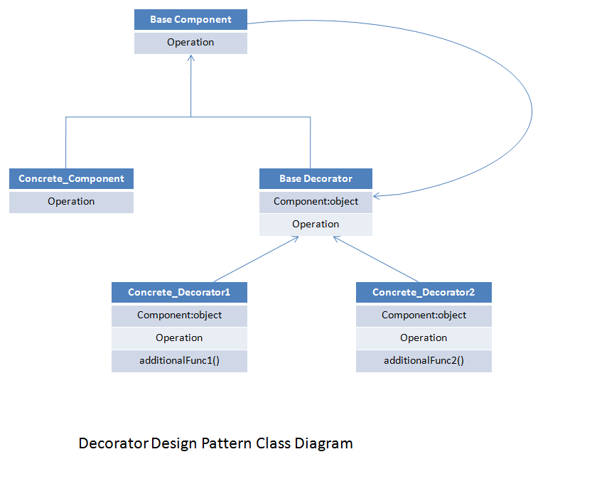

# **`Decorator` Pattern**



## **_Decorator_ Pattern**

### **Bản chất**

**`Decorator` Pattern** cho phép **gắn thêm hành vi** (`behavior`) vào object một cách linh hoạt ở **runtime** mà **không cần sửa class gốc**.

Cụ thể, Decorator:

- bổ sung **new features** (new behaviors)
- Chứa object gốc
- implements cùng interface với object gốc.

**Client** có thể gọi **Decorator** tương tự như gọi object gốc.

Bên cạnh đó, ta có thể **bọc nhiều Decorator chồng lên nhau**.

### **Advantages**

- provides `greater flexibility` than **static inheritance**
- **enhances the extensibility of the object** (`scalable`), because **changes** are **made by coding new classes**.
- simplifies the coding by allowing you to develop a series of functionality from targeted classes instead of coding all of the behavior into the object.

### **Usecases**

- want to `transparently` (minh bạch) and `dynamically` (động, run-time) add **responsibilities to objects** without affecting other objects.
- want to add responsibilities to an object that you may want to change in future.
- Extending functionality by sub-classing is no longer practical

---

## **Example Code**

```kotlin
// 1. Target Interface: Định nghĩa contract chuẩn
interface Coffee {
    String getDescription();
    double cost();
}

// 2. Concrete Component: Lớp cốt lõi, chứa business logic chính
class BasicCoffee implements Coffee {
    public String getDescription() {
        return "Coffee";
    }

    public double cost() {
        return 2.0;
    }
}

// 3. Decorator Base
abstract class CoffeeDecorator implements Coffee {
    protected Coffee coffee;

    public CoffeeDecorator(Coffee coffee) {
        this.coffee = coffee;
    }
}

// 4. Concrete Decorator:
class MilkDecorator extends CoffeeDecorator {
    public MilkDecorator(Coffee coffee) {
        super(coffee);
    }

    public String getDescription() {
        return coffee.getDescription() + ", Milk";
    }

    public double cost() {
        return coffee.cost() + 0.5;
    }
}

class SugarDecorator extends CoffeeDecorator {
    public SugarDecorator(Coffee coffee) {
        super(coffee);
    }

    public String getDescription() {
        return coffee.getDescription() + ", Sugar";
    }

    public double cost() {
        return coffee.cost() + 0.2;
    }
}


/// Client
Coffee coffee = new BasicCoffee();
coffee = new MilkDecorator(coffee);
coffee = new SugarDecorator(coffee); // bọc nhiều lớp

System.out.println(coffee.getDescription());
System.out.println(coffee.cost());
// Result
// Coffee, Milk, Sugar
// 2.7
```

**Notes**: Kotlin `by`

```kotlin
class MilkDecorator(
    private val coffee: Coffee
) : Coffee by coffee
```

`by` keyword:

- **MilkDecorator** có thể **không cần `override` methods** của Coffee interface.
- Khi này:
  - Những **method `không` được `override`** của **MilkDecorator** sẽ được ủy quyền cho `coffee`

    ```kotlin
    // similar to
    class MilkDecorator(
        private val coffee: Coffee
    ) : Coffee {

        override fun description(): String {
            return coffee.description()
        }

        override fun cost(): Double {
            return coffee.cost()
        }
    }
    ```

  - Những **method mà tự MilkDecorator `override`** sẽ được sử dụng và **không delegate** (ủy quyền) sang `coffee`
