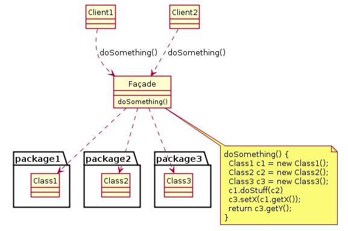

# **`Facade` Pattern**



### **Introduction**

**`Facade` Pattern** provides a **`unified` and `simplified` interface** (thống nhất và đơn giản) to a **set of interfaces in a subsystem**, therefore it **hides the `complexities` of the subsystem** from the **client** (thay mặt client tương tác với một hệ thống con)

### **Advantages**

- **`shields` (che chắn / ẩn) the clients** from the complexities of the sub-system components.
- promotes **loose coupling** between `subsystems` and its `clients`

### **Usecases**

- want to provide simple interface to a complex sub-system.
- **several dependencies exist** between `clients` and **the `implementation classes` of an abstraction** (1 operation của client thao tác với nhiều classes)

### **Example code**

```kotlin
// --- CÁC HỆ THỐNG CON (SUBSYSTEMS) PHỨC TẠP ---
// Trong Spring Boot, tụi này thường là các @Service hoặc external API client
class InventoryService {
    fun checkStock(productId: String): Boolean {
        println("1. [Inventory] Đang kiểm tra tồn kho cho $productId...")
        return true
    }
}

class PaymentService {
    fun processPayment(userId: String, amount: Double): Boolean {
        println("2. [Payment] Đang trừ $amount trong ví của user $userId...")
        return true
    }
}

class ShippingService {
    fun createWaybill(productId: String, address: String): String {
        println("3. [Shipping] Đang tạo vận đơn giao đến $address...")
        return "WAYBILL_888999"
    }
}

class NotificationService {
    fun sendEmail(userId: String, message: String) {
        println("4. [Notification] Đã gửi email xác nhận cho $userId.\n")
    }
}

// --- FACADE CLASS ---
// Mặt tiền che giấu toàn bộ logic phức tạp bên dưới
// Trong Spring, đây chính là một Application Service hoặc Orchestrator Service
class OrderFacade(
    private val inventoryService: InventoryService,
    private val paymentService: PaymentService,
    private val shippingService: ShippingService,
    private val notificationService: NotificationService
) {
    // Cung cấp một API cực kì đơn giản cho Client
    fun placeOrder(productId: String, userId: String, amount: Double, address: String): Boolean {
        println("=== BẮT ĐẦU XỬ LÝ ĐƠN HÀNG ===")

        if (!inventoryService.checkStock(productId)) {
            println("=> Hết hàng!")
            return false
        }

        if (!paymentService.processPayment(userId, amount)) {
            println("=> Thanh toán thất bại!")
            return false
        }

        val trackingId = shippingService.createWaybill(productId, address)
        notificationService.sendEmail(userId, "Đơn hàng của bạn đã tạo thành công. Mã vận đơn: $trackingId")

        println("=== HOÀN TẤT ĐƠN HÀNG ===")
        return true
    }
}

// --- CLIENT ---
// Ví dụ đây là Controller hứng request từ Mobile App
fun main() {
    // Khởi tạo các dependency (Thực tế Spring DI Container sẽ lo việc này)
    val facade = OrderFacade(
        InventoryService(),
        PaymentService(),
        ShippingService(),
        NotificationService()
    )

    // Controller cực kỳ "gọn nhẹ" và "ngu" (Dumb Controller), nó chỉ biết gọi Facade
    val isSuccess = facade.placeOrder("IPHONE_15", "USER_ALEX", 25000.0, "Hanoi, Vietnam")
}
```
