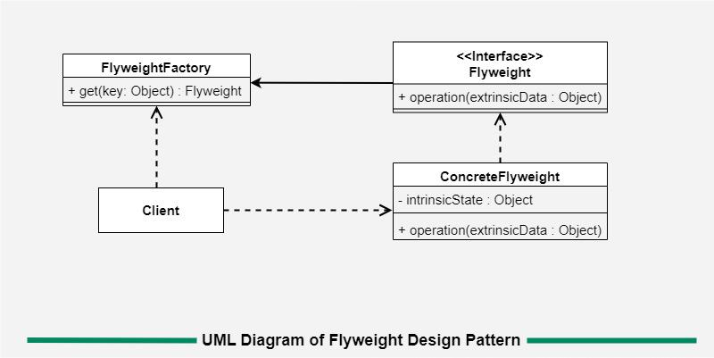

# **`Flyweight` Pattern**



### **Introduction**

Use **`Flyweight` Pattern** to:

- `reuse` already **existing** similar kind of objects by storing them
- `create` new object when **no matching** object is found

#### `Intrinsic` vs `Extrinsic`

- **`Intrinsic` State - State nội tại** là những **data không thay đổi (`immutable`)** và **giống nhau ở rất nhiều object**
  > Phần này sẽ được **rút ra**, **nhét vào một object Flyweight duy nhất và share** (chia sẻ) cho tất cả những thằng cần dùng
- **`Extrinsic` State - State bên ngoài**: những data thay đổi liên tục theo từng context cụ thể.

> _**Ý tưởng**: giống nhau thì dùng chung, không tạo lại_

### **Advantages**

- reduces the `number` of objects.
- reduces the `amount` of `memory` and `storage devices` required if the objects are persisted

### **Usecases**

- an application uses number of objects
- the `storage cost` is high because of the **`quantity` of objects**
- the application does not depend on object identity.

### **Example Code**

```kotlin
import java.util.concurrent.ConcurrentHashMap

// 1. Intrinsic State (Trạng thái nội tại - Được share)
// Class này đại diện cho loại xe (chứa data tĩnh, nặng và trùng lặp)
class VehicleModel(
    val brand: String,
    val type: String,
    val iconUrl: String,
    val maxSpeed: Int
) {
    // Nhận Extrinsic State từ bên ngoài truyền vào thông qua tham số hàm
    fun renderMarker(driverId: String, lat: Double, lng: Double) {
        println("[Render] Xe $brand ($type) của tài xế $driverId đang ở tọa độ ($lat, $lng)")
    }
}

// 2. Flyweight Factory (Bộ máy sản xuất & quản lý bộ nhớ đệm)
// Đảm bảo mỗi loại VehicleModel chỉ tồn tại DUY NHẤT 1 instance trên RAM
object VehicleModelFactory {
    // Dùng ConcurrentHashMap để đảm bảo Thread-safe trong môi trường backend multi-thread
    private val models = ConcurrentHashMap<String, VehicleModel>()

    fun getVehicleModel(brand: String, type: String): VehicleModel {
        val key = "${brand}_${type}"

        // Cú pháp getOrPut của Kotlin cực kì lợi hại cho logic Caching
        return models.getOrPut(key) {
            println("=> [Cache Miss] Khởi tạo model mới lưu vào RAM: $brand $type")
            // Giả lập load icon từ S3/Database mất thời gian và tốn memory
            VehicleModel(brand, type, "https://s3.domain.com/icons/$key.png", 110)
        }
    }

    fun getCacheSize() = models.size
}

// 3. Client Layer (Nơi chứa Extrinsic State)
class TrackingService {
    // Mảng này chỉ chứa reference đến Flyweight object và data thay đổi (Lat/Lng),
    // nên kích thước cực kì nhỏ nhắn.
    fun updateLocation(driverId: String, brand: String, type: String, lat: Double, lng: Double) {
        // Lấy Flyweight object từ Factory (thường là hit cache)
        val model = VehicleModelFactory.getVehicleModel(brand, type)

        // Gọi hàm và bón Extrinsic state (Tọa độ) vào cho nó xử lý
        model.renderMarker(driverId, lat, lng)
    }
}

// --- Chạy thử ---
fun main() {
    val service = TrackingService()

    // 100,000 tài xế Honda Wave cập nhật vị trí, nhưng RAM chỉ chứa ĐÚNG 1 object VehicleModel
    service.updateLocation("TX_001", "Honda", "Wave", 21.0285, 105.8542)
    service.updateLocation("TX_002", "Honda", "Wave", 21.0300, 105.8500)
    service.updateLocation("TX_003", "Yamaha", "Sirius", 21.0100, 105.8100)
    service.updateLocation("TX_004", "Honda", "Wave", 21.0500, 105.8200)

    println("\nTổng số object VehicleModel thực tế trên RAM: ${VehicleModelFactory.getCacheSize()}")
    // Kết quả chỉ là 2 (Honda Wave và Yamaha Sirius)
}
```
