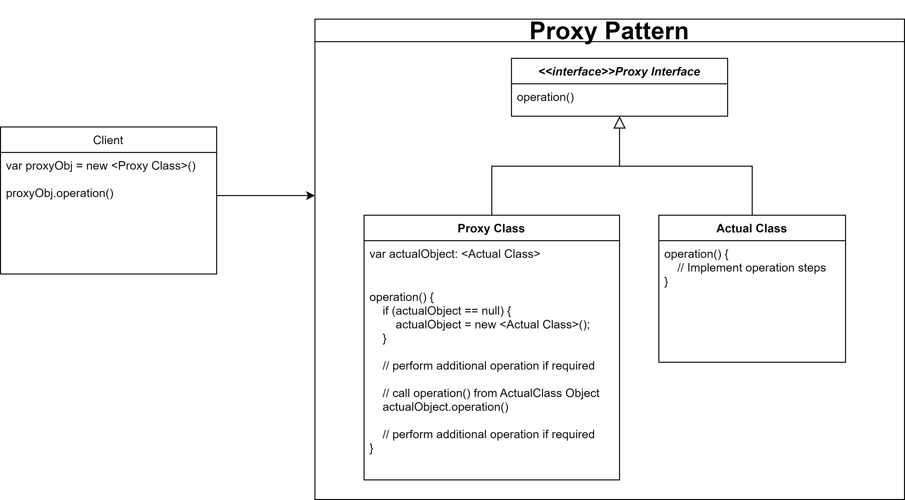

# **`Proxy` Pattern**



Về mặt **cấu trúc code** (`Class Diagram`), Proxy **giống** Decorator đến 99%:

- cả hai đều bọc (wrap) một object gốc
- implement cùng một interface với object đó.

Nhưng về **mục đích** (`Intent`) thì chúng khác nhau một trời một vực:

- `Decorator` sinh ra để thêm tính năng (`add behavior`)
- `Proxy` sinh ra để kiểm soát quyền truy cập (`control access`) vào object gốc

### **Introduction**

**`Proxy` Pattern**: Cung cấp một **object đại diện** (`surrogate`/`placeholder`) để **thay mặt `client` giao tiếp với object thật** (`RealSubject`).

Proxy có quyền quyết định:

- request của client có được phép đi tiếp vào object thật hay không
- hoãn việc tạo object thật cho đến khi thực sự cần thiết

### **Advantages**

`Proxy` provides the `protection` to the **original object** from the **outside** world

### **Proxy Types**

- **`Virtual` Proxy** - Lazy Loading: **Khởi tạo** object thật (thường tốn rất nhiều RAM/CPU) **chỉ khi client thực sự gọi hàm của nó**.

  Ex: Lazy fetch trong Hibernate, ...

- **`Protection` Proxy** - Access Control: Kiểm tra xem client **có đủ quyền** (`Role`/`Permission`) để gọi object thật không.

  Ex: Spring Security,...

- **`Remote` Proxy**: **Object thật** nằm ở một **`server`/`process` khác**. Proxy giả vờ như object đang ở local, giấu đi các logic gọi mạng (TCP/HTTP).

  Ex: gRPC Stubs, Feign Clients, ...

- **`Smart` Proxy**

### **Example Code**

```kotlin
// 1. Target Interface: Giao thức chung
interface VideoDownloader {
    fun downloadVideo(videoId: String)
}

// 2. Real Subject: Object thật, chứa logic cốt lõi nhưng khởi tạo nặng và tốn resource
class RealVideoDownloader : VideoDownloader {
    init {
        println("=> [Hệ thống] Đang khởi tạo kết nối TCP/IP tới CDN Server... (Rất nặng)")
        Thread.sleep(2000) // Giả lập tốn thời gian
    }

    override fun downloadVideo(videoId: String) {
        println("   [RealDownloader] Đang kéo stream video 4K cho ID: $videoId...")
    }
}

// 3. Proxy: Kẻ gác cổng bảo vệ Real Subject
class ProxyVideoDownloader(
    private val userRole: String
) : VideoDownloader {

    // Kĩ thuật Lazy Initialization: Chỉ tạo Real Object khi thực sự cần
    private var realDownloader: RealVideoDownloader? = null

    override fun downloadVideo(videoId: String) {
        // A. Protection Proxy: Chặn kiểm tra quyền (Access Control)
        if (userRole != "PREMIUM") {
            println("[Proxy] Access Denied! Tài khoản FREE không được tải video.")
            return
        }

        // B. Virtual Proxy: Khởi tạo lười (Lazy Load)
        if (realDownloader == null) {
            println("[Proxy] Lần đầu tiên gọi hàm, bắt đầu khởi tạo RealDownloader...")
            realDownloader = RealVideoDownloader()
        }

        // Ủy quyền (Delegate) cho object thật làm việc
        realDownloader!!.downloadVideo(videoId)
    }
}

// --- Client Code ---
fun main() {
    println("--- Test 1: User FREE ---")
    val freeProxy = ProxyVideoDownloader(userRole = "FREE")
    // Request bị chặn ngay tại cửa, RealVideoDownloader KHÔNG HỀ được khởi tạo (tiết kiệm resource)
    freeProxy.downloadVideo("VID_123")

    println("\n--- Test 2: User PREMIUM ---")
    val premiumProxy = ProxyVideoDownloader(userRole = "PREMIUM")
    // Lần 1: Bắt đầu khởi tạo kết nối (chậm)
    premiumProxy.downloadVideo("VID_999")

    // Lần 2: Tái sử dụng kết nối đã tạo (nhanh)
    println("  -> Kéo tiếp video khác:")
    premiumProxy.downloadVideo("VID_888")
}
```
